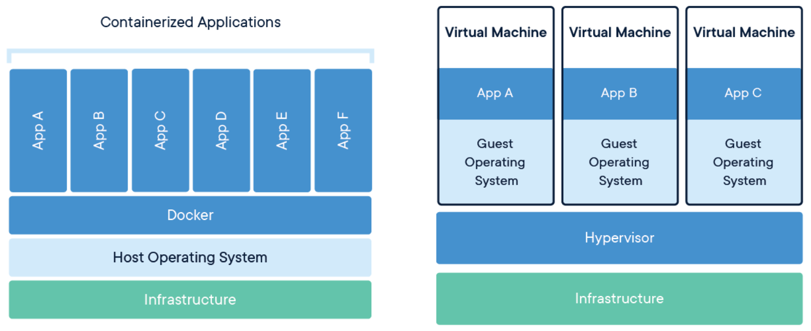
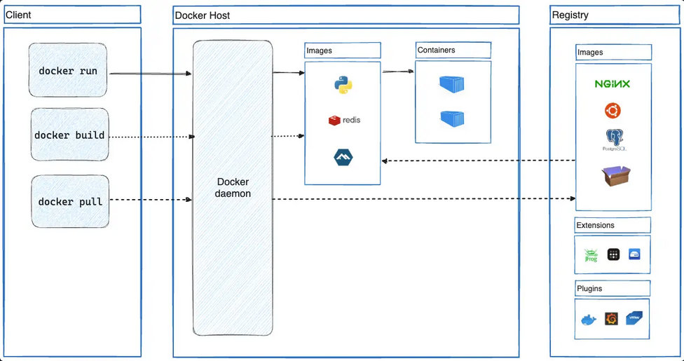
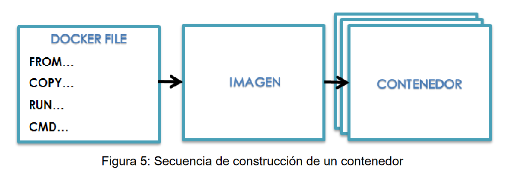

# Docker

## Why is docker ?

Containerization technology that allows developers to create, deploy, and run applications in isolated environments called containers.

### VM vs Docker



## Architecture



## Docker key concepts

Docker follows a client-server architecture.

- Imagen: Is a read-only template with instructions for creating a Docker container, snapshot of a container.
- Container: Instance of an image.
- DockerFile: Text file containing all the instructions for building a Docker image.
- Registry: Docker image repository.
- Containerization: Process of packaging an application and its dependencies into a container.
- Docker client: UI for managing docker.
- Docker daemon: Docker server that manages the Docker engine and is always listening for requests from the Docker client.
- Docker volumes: Manage: Manages data persistence by storing it on the host machine's file system. (data generated in docker is ephemeral).
- Docker network: System that manages communication between the container and the outside world.
- cgroup: Controls the amount of resources a container can use
- namespace: Isolates the processes of a container
- volume: A folder that is stored on the host machine and can be used to share data between multiple containers

## Dockerfile



### Dockerfile commands

| Comando                                             | Descripción                                                                                                                                                      |
| --------------------------------------------------- | ---------------------------------------------------------------------------------------------------------------------------------------------------------------- |
| FROM `<image>`:`<tag>`                              | Specifies the base image. The tag is optional, default is "latest"                                                                                               |
| RUN `<command>`                                     | Execute a command inside the container in a new layer.                                                                                                           |
| COPY `<source>` `<destination>`                     | Copy files and directories to the container.                                                                                                                     |
| ADD `<source>` `<destination>`                      | Copy files or directories to the container (supports URLs and file unzipping).                                                                                   |
| CMD ["executable", "param1", "param2", ...]         | Provides default values ​​or arguments for ENTRYPOINT or, if there is no ENTRYPOINT, is the command that is run when the container starts and can be overridden. |
| ENTRYPOINT ["executable", "param1", "param2", ... ] | Defines the main command that will always be executed when the container starts.                                                                                 |
| WORKDIR /path                                       | Sets the working directory for the RUN, CMD, ENTRYPOINT, COPY, and ADD commands.                                                                                 |
| EXPOSE `<port>`                                     | It exposes a port of the container, but it is necessary to map them in order to use them with the -p option of docker run.                                       |
| ENV `<key>` `<value>`                               | Sets environment variables in the container.                                                                                                                     |
| ARG                                                 | Define a build variable in the Dockerfile.                                                                                                                       |
| VOLUME /path                                        | Create a mount point in the container with a volume.                                                                                                             |
| USER `<username>`                                   | Sets a username to use when launching the container                                                                                                              |
| LABEL                                               | Add metadata to the container.                                                                                                                                   |
| HEALTHCHECK `<command>`                             | Specifies a command to check the health status of the container.                                                                                                 |
| STOPSIGNAL                                          | Specifies the signal to send to the container to stop it.                                                                                                        |

## Command for container management

```Dockerfile
# Create a container from an image
docker run -it --name < container-name < -p < host-port <:< container-port < -d <image-name<

# list containers
docker ps -a

# acces containers or exec commands in containers
docker exec -it <container-name< <command< /bin/bash

# check healthcheck
docker inspect --format='{{json .State.Health}}' <container-name<

# see logs
docker log -ft <container-name<

```

## Command for images management

```bash
# list images
docker images

# delete an image
docker rmi < image <

# delete all unused images
docker image prune -a

# Build a image from a Dockerfile
docker build -t < image-name <:< tag < < path of dockerfile <

# tag a image
docker tag < image < < new-image-name <: < tag <

# publish an image
docker push < image <: < tag <

```

## Command for volumes management

Docker volumes are independent file systems that Docker manages and stores on the host.

```bash
# create a volume
docker volume create < volume <

# list volumes
docker volume ls

# inspect volume
docker volume inspect < volume <

# delete a volume
docker volume rm < volume <

# mount a volume inside a container
docker run -v < volume <:< container-path < < image <

```

## Command for network management

```bash
# create a network
docker network create < network <

# list networks
docker network ls

# connect a container to a network
docker network connect < network < < container <

# disconnect a container to a network
docker network disconnect < network < < container <

# delete a network
docker network rm < netwrok <

# excecute a container on a specific network
docker run --network < network < < image <

# Create a network
docker network create \
  --driver bridge \
  --subnet=192.168.1.0/24 \
  --gateway=192.168.1.1 \
  <network-name<

```

## Other importants commands

```bash
# Commit changes in a container to a new image
docker commit < container < < new image <

# View statics for a container
docker stats < container <

# Rename a conainer
docker rename < old name container < < new container name <

# Runa a container with custom enviroments
docker run -e VAR=var1 -e VAR=var2 < image <

# limit the resource of a container
docker run --cpus=".5" --memory="256m" < image-name <

```
